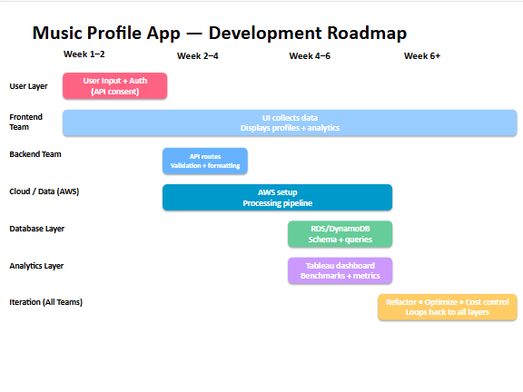
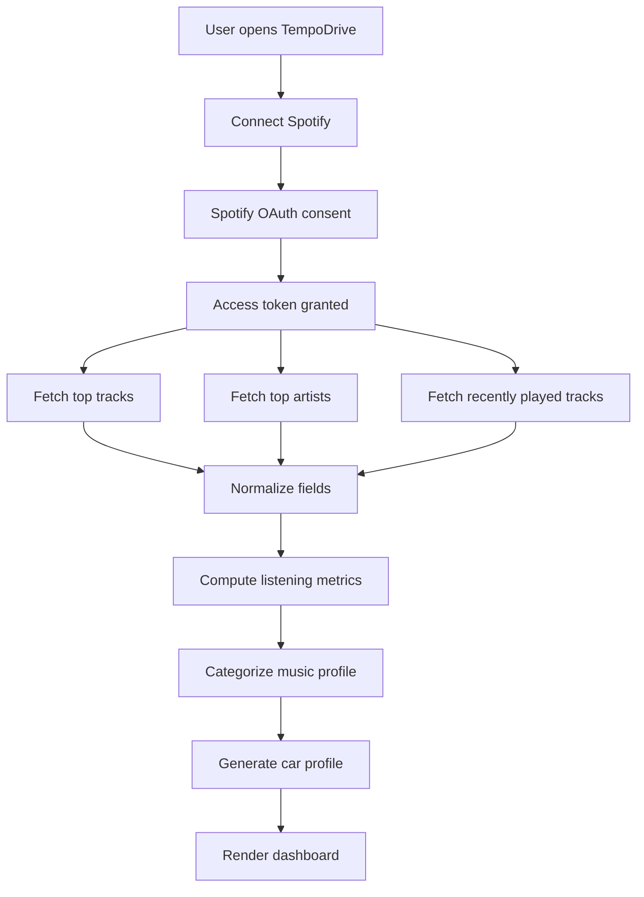

# TempoDrive: A Spotify-Based Web App That Turns Listening History into a Car Profile

**Jaime Soto**  
**Integrative Project Management**  
**Spring 2026**

---

## Abstract

TempoDrive is a proposed web application that uses Spotify listening data, collected only after user consent, to generate a personalized car profile based on a user's music habits. The project is designed as a standard software project, not an open-source project. Its main purpose is to show how a simple web application can connect to the Spotify Web API, retrieve user-approved listening data, categorize that data, and turn it into a creative output that users can understand quickly. Instead of only showing a user their top artists or top tracks, TempoDrive interprets listening patterns through a playful design idea: if a person's music taste could be represented as a car, what would that car be?

The project focuses on a small but complete technical workflow. A user enters the app, connects their Spotify account, approves limited API permissions, and then receives a dashboard showing their top songs, top artists, dominant genres, listening frequency, and a final car recommendation. The car profile is not meant to be a scientific personality assessment. It is a transparent categorization system based on explainable metrics such as genre concentration, tempo or energy if available, most listened-to track, and recent listening behavior. This makes the project realistic for a student team because it avoids becoming a full recommendation system, streaming platform, or social media product.

The project roadmap divides development across the user layer, frontend team, backend team, cloud/data layer, database layer, analytics layer, and final iteration stage. Week 1-2 focuses on user input and Spotify authentication. Week 2-4 focuses on API routes, validation, and formatting. Week 4-6 focuses on AWS setup, the data processing pipeline, database schema, and dashboard metrics. Week 6 and beyond focuses on refactoring, cost control, and feedback loops across all layers. The final result is a practical web app concept that combines API integration, data ethics, workflow mapping, and user-centered design.

---

## Introduction

Digital music platforms have become a major part of everyday life. People listen to music while studying, driving, working out, walking to class, getting ready, or relaxing at night. Because of this, music data can say a lot about a person's routine and preferences. However, most listeners only see this data in limited ways. A user might see a yearly music recap, a playlist suggestion, or a list of top songs, but they do not always get a simple interface that explains what their music taste means in a creative and personal way.

TempoDrive is my proposed answer to that problem. It is a web app that uses the Spotify Web API to retrieve a user's listening data after consent and transform that data into a car profile. The central idea is simple: music taste has personality, and cars also have personality. A person who mostly listens to high-energy rap, trap, or EDM might receive a sport coupe or modified street car profile. A person who listens to a wide variety of genres across different moods might receive a crossover or road-trip vehicle. A person who listens to calm R&B, jazz, or acoustic music late at night might receive a luxury sedan or cruiser profile. These outputs are not meant to label the user permanently. They are meant to make personal music data more visual, memorable, and fun.

The project is intentionally simple. It does not try to compete with Spotify, recommend new songs, or create a streaming service. It only uses user-approved Spotify data to categorize listening patterns through a web interface. This makes the project realistic for a short development timeline. It also allows the report to focus on project management, workflow mapping, data consent, technical architecture, and the practical challenges of building an API-based application.

The project also connects to the goals of an integrative project management course. A strong project report should describe the project, the community it serves, why the project matters, how the work would be done in practice, and what roadmap or workflow would guide implementation. The assignment materials also emphasize project vision, principles, roadmap/workflows, figures, tables, and implementation possibilities. TempoDrive fits that structure because it has a clear user community, a defined technical workflow, and a final product output that can be explained through both a roadmap and system architecture.

---

## Motivation

I chose this project because music is already something I care about, and I wanted the project to feel connected to a real app I could imagine building. Many people already enjoy seeing their top songs or favorite artists, but those summaries usually stop at lists. They tell users what they listened to, but they do not always turn the data into something more personal or interactive. I wanted to create a project that makes music data feel more alive.

The car idea came from wanting the app to have a stronger identity. A basic "music profile app" can sound generic because many apps already show music statistics. By connecting listening history to cars, TempoDrive becomes more specific and easier to remember. It gives the project a visual direction. Instead of only asking, "What kind of music do you listen to?" the app asks, "If your music taste was a car, what would it be?" That question makes the app feel more playful while still relying on structured data.

This project also fits my interest in data, APIs, and user-facing applications. It combines several skills: frontend design, backend routing, authentication, database design, cloud deployment, and analytics. It also requires thinking about privacy because music data is personal. A person's listening history can reveal moods, routines, and social preferences, so the project has to be designed carefully. That is why the app begins with user consent and keeps the scope limited to only the data needed for the profile.

TempoDrive is also useful as a portfolio-style project. It is simple enough to build, but complete enough to show real software development. It has authentication, third-party API integration, a database layer, a processing pipeline, and a dashboard. Most importantly, it has a creative output that makes the project more memorable than a standard data table or chart.

---

## Project Statement

TempoDrive is a web-based application that connects to a user's Spotify account through OAuth consent and retrieves selected listening data from the Spotify Web API. The app uses this data to identify listening patterns such as top tracks, top artists, dominant genres, listening frequency, and recent listening behavior. These patterns are then transformed into a car recommendation that reflects the user's music identity.

The primary output of the app is a personalized dashboard. This dashboard includes the user's top song, top artist, most common genre, recent listening summary, and generated car profile. The car profile includes a car type, short explanation, and the music traits that caused the recommendation. For example, the app may say:

> Your music taste matches a Midnight Sport Coupe because your recent listening history is high-energy, genre-focused, and driven by repeated tracks from rap and electronic artists.

This explanation matters because the app should not feel like a random generator. The user should be able to see why they received a certain result. The recommendation logic should be transparent, simple, and connected directly to the user's data.

TempoDrive is not an open-source project in this version of the report. It is a standard software project managed by a development team. The project still uses good project management practices such as documentation, staged development, testing, feedback loops, and cost control. However, its main focus is not open-source governance. Its focus is the design and implementation of a working web app that uses consented Spotify data to generate a creative profile.

---

## Target Audience

The target audience for TempoDrive is made up of Spotify users who enjoy music statistics, personal dashboards, and creative identity-based results. The app would be especially appealing to students, music fans, playlist makers, DJs, car enthusiasts, and people who like sharing personalized results with friends. It is designed for users who already enjoy apps such as music recaps, personality quizzes, playlist generators, and profile-based dashboards.

The app also has value for people learning about data and web development. Since the app uses real API data, it can demonstrate how consent-based data retrieval works in practice. A student or developer reviewing the project could see how frontend authentication, backend API routes, data processing, and visualization work together.

The user community can be divided into three groups. The first group is casual listeners who want a fun result. They may not care about the technical details, but they want to see their car profile and understand the basic reason behind it. The second group is music-focused users who want deeper analytics. They may care about top genres, repeated songs, listening frequency, or how their taste changes over time. The third group is technical reviewers, such as classmates or instructors, who want to understand how the app works as a managed project.

This audience makes the app more realistic because it does not require a massive user base to be useful. Even a small group of pilot users could test whether the categorization logic feels accurate, fun, and understandable.

---

## Benefits

The main benefit of TempoDrive is that it turns raw listening data into an engaging and understandable profile. A list of top songs can be interesting, but a car profile gives that same data a stronger visual identity. This makes the app easier to share, explain, and remember.

Another benefit is that the app teaches users something about their music habits. The dashboard can show whether a user listens to a narrow set of genres or a wide range of styles. It can show whether their listening history is dominated by a few repeated songs or spread across many artists. It can also show whether the user's recent listening pattern feels high-energy, relaxed, nostalgic, or experimental based on the data available.

From a technical perspective, the project benefits the development team because it is small but complete. It includes user authentication, API requests, data cleaning, data storage, categorization, and frontend visualization. These are important pieces of real software projects. The app also has clear boundaries, which helps prevent the project from becoming too large.

The project also benefits the course assignment because it can be explained through a roadmap, workflow map, and system design. Instead of only describing an idea, the report can show how the app moves from user consent to data retrieval to dashboard output.

---

## Vision Statement

The vision of TempoDrive is to create a simple web app that transforms user-approved Spotify listening data into a creative car profile that helps users understand their music identity in a fun and transparent way. The app should make personal music data feel less hidden and more understandable without overcomplicating the experience. Instead of building a large recommendation engine, TempoDrive focuses on one clear task: take consented listening data, categorize it, and return a meaningful visual profile.

The long-term vision is not to become a replacement for Spotify. It is to become a lightweight companion tool that gives users a fresh way to reflect on their music habits. The strongest version of the project is one where the user can see the data used, understand the recommendation, refresh the profile, and delete their stored information when they want.

---

## System Architecture

TempoDrive uses a layered architecture. Each layer has a specific responsibility, which makes the project easier to manage and debug.

| Layer | Responsibility | Main Output |
|---|---|---|
| User Layer | User enters app and gives Spotify consent | Authorized user session |
| Frontend Layer | Displays login, dashboard, charts, and car result | User-facing interface |
| Backend Layer | Handles OAuth callbacks, API routes, validation, and formatting | Clean API responses |
| Cloud/Data Layer | Hosts backend services and processing tasks | Deployed app infrastructure |
| Database Layer | Stores temporary user profile data and generated results | Structured user profile records |
| Analytics Layer | Computes genre, track, frequency, and car profile metrics | Categorized dashboard data |
| Iteration Layer | Refactors, optimizes, controls cost, and improves the app | Stable project after v1 |

The user layer begins with authentication. When a user clicks "Connect Spotify," the app sends them through Spotify's OAuth flow. For a browser-based or single-page web app, Spotify recommends Authorization Code with PKCE when a client secret cannot be safely stored in the frontend. After authorization, the app receives an access token and can make approved API calls.

The backend layer is responsible for keeping the data flow controlled. It should not let the frontend directly manage all logic. Instead, the frontend should call backend routes such as `/api/top-tracks`, `/api/top-artists`, `/api/recently-played`, and `/api/generate-profile`. These routes can validate tokens, request data from Spotify, format the response, and send only the needed fields back to the frontend.

The database layer can remain simple. For a prototype, the app can store only a user ID hash, the generated profile, and a timestamp. If more storage is needed, it can store recent play events, top tracks, top artists, and derived metrics. The app should avoid storing unnecessary raw data for long periods.

---

## Workflow Mapping

Figure 1 shows the TempoDrive development roadmap. This map breaks the project into layers and weeks so that the app does not become one large, unorganized task.



The workflow begins in Week 1-2 with the user layer. This stage focuses on user input, authentication, and Spotify API consent. This is the correct first step because the app cannot retrieve personal Spotify data without user authorization. The goal of this stage is to create a working login flow and confirm that the app can receive an access token.

The frontend team works across the entire project because the user interface is central to the app. Even while backend routes and databases are being developed, the frontend needs to display loading states, login screens, dashboard cards, charts, and the final car profile. This is why the roadmap shows the frontend layer stretching across multiple weeks.

Week 2-4 focuses on backend API routes. This includes routes for top tracks, top artists, recently played tracks, and profile generation. It also includes validation and formatting so that the app does not pass messy raw API data directly into the dashboard.

Week 4-6 focuses on AWS setup, the data processing pipeline, and database schema. This stage turns the app from a local prototype into a deployable project. The cloud/data layer supports hosting, API execution, and cost monitoring. The database layer supports structured storage of user sessions, listening snapshots, and generated car profiles.

The analytics layer also appears during Week 4-6 because the app needs a clear way to convert music data into user-facing metrics. This includes calculating top genre, genre diversity, repeated track behavior, and listening frequency. The final Week 6+ stage focuses on refactoring, optimization, cost control, and feedback loops. This final stage is important because the first working version will likely need changes after testing with users.

---

## Development Methodology

TempoDrive should use an Agile development approach because the app depends on testing, iteration, and user feedback. The first version should not try to include every possible feature. Instead, the project should be divided into small sprints that each create a working piece of the system.

The first sprint should focus on authentication. The team should create the app, register it in the Spotify Developer Dashboard, configure redirect URIs, and implement the OAuth flow. The goal is not to build the full dashboard yet. The goal is only to prove that the user can sign in and approve access.

The second sprint should focus on data retrieval. The backend should call Spotify's top tracks, top artists, and recently played endpoints. The team should inspect the returned data and decide which fields are necessary. For example, top tracks may include track name, artist name, album image, popularity, and Spotify ID. Top artists may include genres, artist image, and popularity. Recently played tracks may include timestamps and context.

The third sprint should focus on categorization. This is where the app becomes more than a Spotify data viewer. The team should create logic that converts the raw listening data into categories. For example, the app can calculate whether a user's listening history is genre-focused or genre-diverse, whether the recent tracks show repeated behavior, and whether the profile feels high-energy or relaxed.

The fourth sprint should focus on the car recommendation output. The team should design a set of car archetypes and connect them to the music categories. The app should not use a black-box model for this version. A rules-based mapping is better because it is easier to explain and debug.

The final sprint should focus on deployment, testing, and feedback. Users should test whether the car result feels accurate or random. Their feedback can be used to adjust the mapping logic and dashboard design.

---

## Data Pipeline

The data pipeline is the technical path from Spotify consent to final dashboard output.



The first step is user authentication. The app redirects the user to Spotify and requests limited scopes. For this project, the most important scopes are `user-top-read` and `user-read-recently-played`. The `user-top-read` scope allows the app to read a user's top artists and tracks. The `user-read-recently-played` scope allows the app to access recently played tracks.

The second step is data retrieval. The app retrieves top tracks, top artists, and recently played tracks. Top artists are important because they include genre data, which is one of the strongest signals for the car recommendation. Top tracks are important because they provide the user's most repeated or most representative songs. Recently played tracks are important because they show listening recency and time patterns.

The third step is normalization. Spotify data can contain nested objects, arrays, IDs, images, links, timestamps, and artist metadata. The app should reduce that data into a simpler format. For example:

| Field | Description |
|---|---|
| `track_name` | Name of the song |
| `artist_name` | Main artist |
| `artist_genres` | Genres associated with artist |
| `played_at` | Recent play timestamp |
| `rank` | Position in top-track or top-artist list |
| `popularity` | Spotify popularity score, if available |
| `image_url` | Album or artist image for dashboard |

The fourth step is metric computation. The app calculates top song, top artist, most common genre, genre diversity, repeated listening behavior, and recent listening frequency. These metrics are then passed into the car recommendation system.

The final step is rendering. The frontend displays charts, summary cards, and the car profile. The dashboard should explain the result using phrases like "because your top artists are mostly in rap and trap" or "because your listening history is spread across many genres."

---

## API Integration

Spotify is the main data source for TempoDrive. The Spotify Web API provides endpoints for user data after authorization. The most important endpoint for this project is "Get User's Top Items," which returns the current user's top artists or tracks. Spotify's documentation states that this endpoint requires OAuth and the `user-top-read` authorization scope. It also allows the app to request artists or tracks and choose different time ranges such as short term, medium term, and long term.

The second important endpoint is "Get Recently Played Tracks." This endpoint retrieves tracks from the current user's recently played history and requires the `user-read-recently-played` scope. This endpoint is useful because it includes timestamps, which help the app understand when the user is listening.

TempoDrive should use these endpoints conservatively. The app does not need to constantly refresh data. A user should be able to generate a profile when they choose, and then refresh it later if they want an updated result. This reduces unnecessary API calls and lowers the risk of rate-limit problems. Spotify's rate-limit documentation explains that apps may receive a 429 response when too many Web API requests happen in a short period of time. For that reason, the backend should include retry handling, caching, and refresh limits.

The app should also respect Spotify's developer policy. The app should be truthful about how data is used, provide a clear privacy explanation, and avoid misleading users. Since TempoDrive is a student project, the app should be framed as a lightweight personal dashboard rather than a commercial analytics platform.

---

## Data Categorization Logic

The categorization logic is the core of TempoDrive. Without it, the app would only show Spotify data. With it, the app becomes a creative profile generator.

The first category is dominant genre. This can be calculated by collecting genres from the user's top artists and counting which genre labels appear most often. Since artists often have multiple genre tags, the app should count all tags but group similar ones when possible. For example, "trap," "rap," and "hip hop" can be grouped under a broader hip-hop category.

The second category is genre diversity. A user who listens mostly to one genre should receive a different result than a user who listens across many styles. Genre diversity can be estimated by counting the number of unique genre groups in the user's top artists. A low number suggests a focused taste. A high number suggests an exploratory taste.

The third category is repeat behavior. If the same tracks appear heavily in the user's top songs or recent plays, the app can categorize the listener as routine-driven. If the recent plays are more varied, the app can categorize the user as exploratory.

The fourth category is listening recency and time pattern. Recently played tracks include timestamps, so the app can identify whether listening happens more in the morning, afternoon, evening, or late night. This can influence the car output. Morning-heavy listening might connect to a commuter vehicle. Late-night listening might connect to a cruiser or luxury car profile.

The fifth category is pace or energy. If Spotify-provided audio feature access is available, the app can use tempo or energy-like metrics. If not, this should remain optional. The project should not depend on BPM for the first version because API access can change and tempo estimation can create extra complexity.

A simple profile object could look like this:

```json
{
  "top_song": "Example Track",
  "top_artist": "Example Artist",
  "dominant_genre": "hip-hop",
  "genre_diversity": "medium",
  "repeat_behavior": "high",
  "listening_time": "late-night",
  "pace": "high-energy",
  "car_profile": "Midnight Sport Coupe"
}
```

This structure is useful because every car recommendation can be traced back to specific values.

---

## Car Recommendation Logic

The car recommendation system should be rules-based for the first version. This makes the app easier to build, easier to explain, and easier to adjust after user feedback. A rules-based system is also better for a term project because the logic can be documented clearly.

The app can start with a fixed set of car archetypes:

| Car Profile | Music Pattern | Explanation |
|---|---|---|
| Midnight Sport Coupe | High-energy genres, late-night listening, focused taste | Fast, stylish, and intense |
| Daily Driver Sedan | Consistent listening, balanced genres, morning or afternoon use | Reliable and routine-based |
| Road Trip SUV | Wide genre diversity, many artists, varied listening times | Flexible and exploratory |
| Classic Cruiser | Older genres, slower pace, relaxed listening | Smooth and nostalgic |
| Luxury Sedan | R&B, jazz, soul, or calm late-night patterns | Polished and relaxed |
| Rally Hatchback | Fast-paced, mixed genres, unpredictable behavior | Energetic and chaotic |
| Project Car | Experimental genres, high diversity, unusual combinations | Unique and constantly changing |
| Electric Concept Car | Electronic, hyperpop, experimental, or futuristic genres | Digital, modern, and high-tech |

The rules can be written in a simple decision process. If the user has high genre diversity and listens across many artists, the app recommends a Road Trip SUV or Project Car. If the user has high repeat behavior and a narrow genre profile, the app recommends a more focused vehicle such as a Sport Coupe or Daily Driver Sedan. If the dominant genre is R&B, jazz, soul, or acoustic music and the listening time is late night, the app recommends a Luxury Sedan or Classic Cruiser.

The output should always include explanation text. For example:

> You got the Road Trip SUV because your top artists are spread across multiple genres and your listening history changes throughout the day. Your profile suggests variety, movement, and flexibility.

This explanation keeps the recommendation from feeling random. The user can understand how the result was generated, which is important for trust and usability.

---

## Technology

TempoDrive can be built using a modern JavaScript-based web stack. The frontend can use React because it supports reusable components and dynamic user interfaces. The dashboard can be divided into components such as LoginButton, TopTracksCard, GenreChart, ListeningTimeline, and CarProfileCard.

The backend can use Node.js with Express or Next.js API routes. Node.js is a good fit because the app needs to handle API requests, token exchange, and JSON responses. The backend should manage Spotify API calls instead of placing all logic in the frontend. This helps keep the app organized and makes it easier to validate responses.

For the database, the project can use DynamoDB, PostgreSQL, or SQLite depending on the deployment stage. SQLite is enough for local testing. PostgreSQL is useful if the team wants relational tables for users, tracks, artists, and profiles. DynamoDB is useful if the team wants a cloud-based, flexible schema that fits small JSON-style profile records. Since the roadmap mentions RDS/DynamoDB, the report can keep both options open: RDS for structured relational querying, DynamoDB for lightweight profile storage.

AWS can be used for cloud deployment. The frontend could be hosted on a static hosting platform, while the backend could run on AWS Lambda, Elastic Beanstalk, or a small server. The database could use RDS or DynamoDB. AWS Budgets should be used to control cost because student projects can accidentally create charges when cloud resources are left running.

The analytics layer can start with simple JavaScript or Python scripts. For v1, the app does not need machine learning. It only needs counting, grouping, scoring, and mapping. A future version could add more advanced features, but the first version should prioritize a working product.

---

## Data Privacy and Ethical Use

Privacy is one of the most important parts of TempoDrive because the app uses personal listening data. Even though the app is playful, listening data can still reveal patterns about a person's routine, moods, and interests. Because of that, the app should be designed with consent, minimization, and transparency from the beginning.

The app should clearly explain what data it requests before sending the user to Spotify. It should request only the scopes needed for the dashboard. For this project, that means the app should focus on `user-top-read` and `user-read-recently-played`. It should not request playlist modification, library modification, playback control, or other permissions that are not needed.

The app should also avoid storing raw listening history longer than necessary. For a prototype, the safest approach is to generate the profile during the session and store only the final result. If the app stores data, it should store minimal fields and provide a delete option. The user should be able to disconnect or clear their profile.

The car recommendation should also avoid sensitive inference. The app should not guess race, gender, income, political identity, mental health, or other sensitive traits. The output should stay connected to visible music metrics. For example, it is acceptable to say "your top artists are mostly hip-hop and your recent plays are high repeat." It is not acceptable to claim that the user has a certain personality type or life situation based on music data.

This ethical boundary makes the project stronger. It shows that the app can be creative without becoming invasive.

---

## Managing Technical Debt

TempoDrive will likely create technical debt in three areas: API integration, categorization logic, and cloud deployment.

The first area is API integration. Spotify tokens expire, rate limits exist, and API access rules can change. To reduce this risk, the backend should be modular. Spotify-specific code should be placed in a service layer rather than scattered across the app. If the Spotify API changes, the team can update one service file instead of rewriting the whole app.

The second area is categorization logic. At first, the rules may be simple and imperfect. Some users may feel that their car profile does not match their music taste. This should be expected. The team can manage this by documenting the rules, collecting user feedback, and adjusting the mapping over time. The app can also show a "why this result" explanation so users understand the logic even if they disagree with the final car.

The third area is cloud deployment. AWS services can become confusing or expensive if they are not monitored. The team should use cost alerts, delete unused resources, and keep the deployment small. For a prototype, the system does not need enterprise scaling. It only needs enough infrastructure to demonstrate the app.

Estimated technical debt can be described as moderate. About 15-20% of extra development time should be expected for authentication debugging, token refresh problems, and API response formatting. Another 10-15% should be expected for refining the car recommendation rules after testing. These estimates are realistic because most of the app is not technically impossible, but several parts require iteration.

---

## Development Roadmap

The roadmap organizes the project into six weeks plus a post-launch iteration stage.

| Time Period | Main Focus | Deliverable |
|---|---|---|
| Week 1-2 | User input and Spotify authentication | Working login and consent flow |
| Week 2-4 | Backend API routes and formatting | Top tracks, top artists, and recent plays API routes |
| Week 4-6 | AWS setup and data pipeline | Hosted backend and database schema |
| Week 4-6 | Analytics dashboard | Metrics for genres, top songs, and listening behavior |
| Week 6+ | Refactor and cost control | Stable version with feedback improvements |

In Week 1-2, the team should register the Spotify app, configure OAuth redirect URIs, and build the login page. In Week 2-4, the team should create backend routes and test API responses. In Week 4-6, the team should create a database schema and deploy the app. During the same period, the analytics layer should calculate the profile metrics and connect them to the frontend dashboard.

Week 6+ is where the app becomes polished. The team should test with users, adjust car mapping logic, improve explanation text, reduce unnecessary API calls, and monitor cloud spending. This stage is important because a first prototype may work technically but still feel confusing or inaccurate to users.

---

## Community and Feedback Strategy

Even though TempoDrive is not an open-source project, it still needs a community and feedback strategy. The main community is the user group of music listeners and students who will test the app. Their feedback will determine whether the car profiles feel accurate, fun, and understandable.

The first feedback group should be a small group of friends, classmates, or music fans who are willing to connect their Spotify account and test the result. They should be asked three questions:

1. Did the car result feel accurate or random?
2. Did the explanation help you understand the result?
3. What music pattern do you wish the app showed more clearly?

The second feedback group should include technical reviewers. They can evaluate whether the workflow, API routes, data schema, and privacy choices are clear. This feedback is useful for improving the app as a project report and as a portfolio piece.

The third feedback group could include car or music enthusiasts. This group can help improve the car archetypes. For example, users may suggest better names for profiles or more accurate connections between genres and car styles.

This feedback strategy keeps the project user-centered without making it too large.

---

## Limitations

TempoDrive has several limitations. First, the app depends on Spotify API access. If Spotify changes endpoint availability, rate limits, or policy rules, the app may need to adjust. Second, genre data is not perfect. Spotify genre labels come mostly from artist metadata, not always from individual tracks. This means a user's "top genre" may be an approximation.

Third, car recommendations are subjective. Two people with similar music taste may imagine different cars. Because of that, the app should not present its output as objective truth. It should present the car profile as a creative interpretation based on visible metrics.

Fourth, the app may not have enough data for new Spotify users or users with limited listening history. If there is not enough data, the app should show a message explaining that it needs more listening activity to generate a stronger result.

Finally, privacy remains a limitation that must be handled carefully. Even simple music data can feel personal. The app should always prioritize user control, transparency, and deletion.

---

## Conclusion

TempoDrive is a focused web application that uses Spotify listening data to generate a personalized car profile. The strength of the project is its simplicity. It does not try to become a streaming platform, a social network, or a full recommendation engine. Instead, it takes a narrow set of user-approved data, organizes it, and turns it into a creative dashboard that users can understand.

The project is useful because it combines technical development with user-centered design. It requires authentication, API integration, backend routing, cloud/data planning, database storage, analytics, and frontend visualization. It also requires privacy awareness because the app works with personal listening data. The final product gives users a fun way to reflect on their music habits while still showing a serious software workflow.

The roadmap makes the project manageable by dividing it into stages: consent, frontend, backend, cloud/data, database, analytics, and iteration. The workflow map shows how each team layer contributes to the final result. By following this structure, TempoDrive can become a realistic student project that demonstrates both technical skill and thoughtful project management.

The overall value of TempoDrive is that it makes music data feel personal without making it overly complicated. It gives users a new way to see their listening history, and it gives the development team a clear project that can be built, tested, improved, and explained.

---

## References

Amazon Web Services. (n.d.). *AWS Budgets documentation*. https://aws.amazon.com/documentation-overview/budgets/

Amazon Web Services. (n.d.). *Amazon DynamoDB documentation*. https://aws.amazon.com/documentation-overview/dynamodb/

Baur, D., Seiffert, F., Sedlmair, M., & Boring, S. (2009). *Visualizing a personal music listening history*. https://www.medien.ifi.lmu.de/pubdb/publications/pub/baur2009iui/baur2009iui.pdf

Node.js. (n.d.). *About Node.js*. https://nodejs.org/en/about/

Spotify for Developers. (n.d.). *Authorization Code with PKCE Flow*. https://developer.spotify.com/documentation/web-api/tutorials/code-pkce-flow

Spotify for Developers. (n.d.). *Get Recently Played Tracks*. https://developer.spotify.com/documentation/web-api/reference/get-recently-played

Spotify for Developers. (n.d.). *Get User's Top Items*. https://developer.spotify.com/documentation/web-api/reference/get-users-top-artists-and-tracks

Spotify for Developers. (n.d.). *Rate Limits*. https://developer.spotify.com/documentation/web-api/concepts/rate-limits

Spotify for Developers. (n.d.). *Scopes*. https://developer.spotify.com/documentation/web-api/concepts/scopes

Spotify for Developers. (2025). *Spotify Developer Policy*. https://developer.spotify.com/policy

Wirfs-Brock, J., Mennicken, S., & Thom, J. (2020). *Giving Voice to Silent Data: Designing with Personal Music Listening History*. CHI '20: CHI Conference on Human Factors in Computing Systems. https://jwirfs-brock.github.io/JWB_website/giving-voice-to-silent-data-CHI2020.pdf

GDPR. (n.d.). *Art. 5 GDPR: Principles relating to processing of personal data*. https://gdpr-info.eu/art-5-gdpr/

GDPR. (n.d.). *Art. 17 GDPR: Right to erasure*. https://gdpr-info.eu/art-17-gdpr/

California Department of Justice. (2024). *California Consumer Privacy Act (CCPA)*. https://oag.ca.gov/privacy/ccpa
